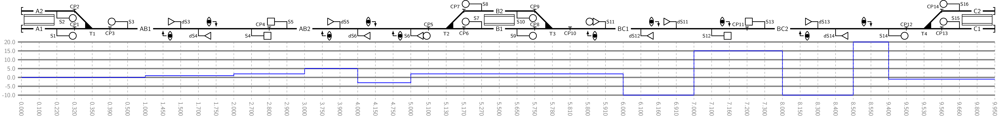

# Running Path Schema

------------

# Specification

## Preamble

| Attributes           | Necessity | Description                                            |
| -------------------- | --------- | ------------------------------------------------------ |
| `schema`             | required  | Identifier of the JSON schema.                         |
| `schema_version`     | required  | Version of the JSON schema.                            |
| `paths`              | required  | An array of at least one [path](#Attributes-in-paths). |

## Attributes in "paths"

All attributes for a path are collected under the array `paths: -` in alphabetical order:

| Attributes               | Necessity | Description |
| ------------------------ | --------- | ----------- |
| `id`                     | required  | Identifier of the running path. |
| `description`            | optional  | Description of the running path. |
| `characteristic_sections`| required  | An array of [characteristic sections](#Attributes-in-characteristic_sections). |
| `points_of_interest`     | optional  | An array of [points of interest](#Attributes-in-points_of_interest). |

## Attributes in "characteristic_sections"

Characteristic sections are sections of a running path within which properties, such as permitted speed or track resistances, do not change.

| Attributes           | Necessity | Description |
| -------------------- | --------- | ----------- |
| `position`           | required  | Position along the path (m) |
| `speed`              | optional[^1] | Maximum permitted speed (km/h) |
| `resistance`         | optional[^1] | Track resistance (‰) |

[^1]: At least one of attributes `speed` or `resistance` must be present.

## Attributes in "points_of_interest"

Points of interest mark specific locations along the path where measurements or observations should be taken.

| Attributes           | Necessity | Description |
| -------------------- | --------- | ----------- |
| `position`           | required  | Position along the path (m) |
| `id`                 | required  | Identifier of the point of interest |
| `description`        | optional  | Description of the point of interest |
| `groups`             | optional  | Groups this point belongs to |
| `measure`            | required  | Position on train to measure; values: `front`, `middle`, or `rear` |

# Units

The schema uses common railway units for all numerical values:

| Quantity         | Unit | Description |
|------------------|------|-------------|
| Position         | m    | Meters |
| Speed            | km/h | Kilometers per hour |
| Resistance       | ‰    | Per mille (mm/m) |
| Unit-less        | -    | Dimensionless values |

# Example
An example file showing a running path with block sections, signals, and platforms can be found in [running-path.example.yaml](running-path.example.yaml). The example includes various points of interest such as platform tracks, route signals, and clearing points, each with specific positions and descriptions. Below is a visual representation of the YAML structure:

